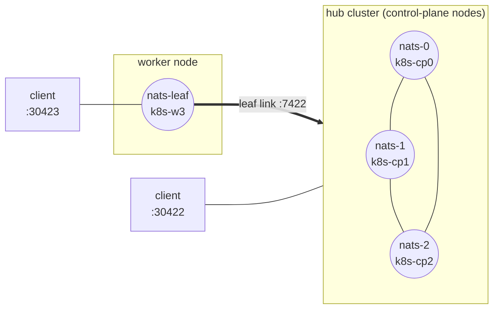

# nats-leaf — leaf-node topology

A self-contained demo that a **leaf node** bridges subject interest between an
edge server and a remote cluster, so clients on either side communicate as if
they shared one NATS.

> NATS docs: [Topologies → Leaf Nodes](https://docs.nats.io/concepts/topologies)

## Topology

In this repo the NATS deployment is a **hub** of three servers on the
control-plane nodes plus one **leaf** on the worker. The leaf initiates an
outbound connection to the hub's leafnode listener (`:7422`) and bridges
interest; clients attach to the hub on NodePort `30422` or to the leaf on
NodePort `30423`.



## What it demonstrates

- A **leaf node** is a full NATS server that makes an **outbound** connection to
  a remote system and bridges subject interest across it — so it can run
  anywhere with outbound access (edge, branch office, a laptop).
- Interest propagates **both ways**: a subscriber on the leaf receives messages
  published on the hub, and vice versa. The demo proves both directions.
- Clients use the **same code** whether they attach to the hub or the leaf —
  the leaf looks like an ordinary server.

The demo opens two connections (hub + leaf) and, for each direction, subscribes
on one side and publishes on the other, asserting the message crosses the link.

> **Security (accepted lab tradeoff).** Like the rest of this lab's buses, the
> NATS hub and leaf run **anonymous, without TLS**. The hub's leafnode listener
> (`:7422`) is **in-cluster only** — it is not exposed on a NodePort, so a leaf
> connection can only be made from within the pod network (the same posture as
> the cluster routes on `:6222`). The leaf's client port is exposed on NodePort
> `30423` with the same no-auth posture as the hub's `30422`. This is acceptable
> only on the isolated `10.33.33.0/24` lab network; a real leaf link should use
> credentials + TLS and scoped [accounts](https://docs.nats.io/running-a-nats-service/configuration/securing_nats/accounts).

## Run it

```bash
nix run .#nats-leaf                                                   # defaults to 127.0.0.1:30422 / :30423
nix run .#nats-leaf -- -hub-addr 10.33.33.10:30422 -leaf-addr 10.33.33.13:30423
```

Flags: `-hub-addr` (cluster NodePort, default `127.0.0.1:30422`), `-leaf-addr`
(leaf NodePort, default `127.0.0.1:30423`), `-timeout`, `-settle` (how long to
let interest propagate across the link before publishing).

> **Off-box addressing.** The leaf's client port is on NodePort `30423`; the hub
> is on `30422`. Both are reachable on any node IP — pass a node IP (e.g. the
> worker `10.33.33.13:30423` for the leaf) when there is no tunnel to
> `127.0.0.1`.

The program is **self-verifying**: it exits non-zero unless a message crosses
the leaf link in both directions.

## Sample output

```
[hub pub] -> leaf.demo.hub2leaf : "crossing hub->leaf"
[leaf sub] <- leaf.demo.hub2leaf : "crossing hub->leaf"  (crossed the leaf link)

[leaf pub] -> leaf.demo.leaf2hub : "crossing leaf->hub"
[hub sub] <- leaf.demo.leaf2hub : "crossing leaf->hub"  (crossed the leaf link)

PASS: subject interest bridged both ways across the leaf link
```
