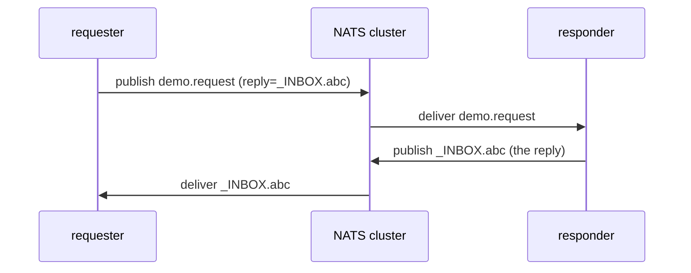

# nats-request-reply — synchronous request/reply

A self-contained demo of the NATS **request-reply** pattern: RPC-style,
synchronous calls built on top of core pub/sub.

> NATS docs: [Request-Reply](https://docs.nats.io/concepts/request-reply)

## Topology

Both halves run in one process. A **responder** subscribes to `demo.request`
and answers each message; a **requester** issues `Request()` calls and blocks
for each reply. Each request carries a unique, auto-generated `_INBOX.<nuid>`
reply subject that the responder replies to.



## What it demonstrates

- `nc.Request(subject, body, timeout)` wraps the whole dance: create a unique
  inbox, subscribe to it, publish the request with that reply subject, and wait.
- The responder just calls `msg.Respond(...)` — it replies to whatever inbox the
  request carried, so it never needs to know the requester's address.
- The exchange is **synchronous** from the caller's side (it blocks up to
  `-timeout`) even though NATS underneath is asynchronous pub/sub.

## Run it

```bash
nix run .#nats-request-reply                                    # defaults to 127.0.0.1:30422
nix run .#nats-request-reply -- -count 5 -addr 10.33.33.10:30422
```

Flags: `-count` (requests to send, default 3), `-timeout` (per-request reply
timeout, default 2s), `-addr`.

> **Off-box addressing.** The bus is reachable on any node IP at NodePort
> `30422`; pass `-addr <node-ip>:30422` when there is no tunnel to
> `127.0.0.1`.

The program is **self-verifying**: it exits non-zero unless every request
received a reply.

## Sample output

```
[req] -> demo.request : ping 1
[rep] <- _INBOX.2L27hYVhamdGCZ93bnAuTb.CybxuUND : re: "ping 1" at 2026-...
...
summary: 5/5 requests answered
PASS: every request got a synchronous reply via its _INBOX subject
```
