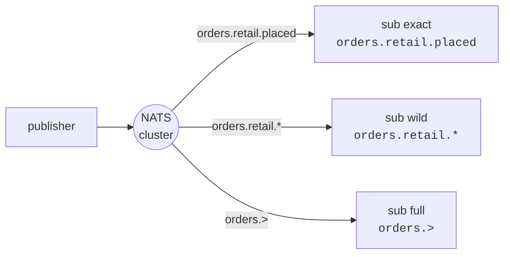

# nats-subjects — subjects & subject hierarchies

A self-contained demo of how NATS routes messages by **subject**, and how
**wildcards** subscribe across a subject hierarchy.

> NATS docs: [Subjects](https://docs.nats.io/concepts/subjects)

## Topology

One publisher sends a fixed list of `orders.*.*` subjects. Three subscribers,
all on the same connection, listen at three different levels of the hierarchy —
so each message fans out only to the subscribers whose pattern matches it.



Published subjects and who matches them:

| subject                    | `orders.retail.placed` | `orders.retail.*` | `orders.>` |
| -------------------------- | :--------------------: | :---------------: | :--------: |
| `orders.retail.placed`     |           ✅           |        ✅         |     ✅     |
| `orders.retail.shipped`    |                        |        ✅         |     ✅     |
| `orders.wholesale.placed`  |                        |                   |     ✅     |
| `orders.wholesale.shipped` |                        |                   |     ✅     |
| **matches**                |         **1**          |       **2**       |   **4**    |

## What it demonstrates

- A **subject** is the named channel that connects publishers and subscribers —
  no direct addressing.
- The `.` character builds a **hierarchy** (`orders.retail.placed`).
- `*` matches exactly **one token**; `>` matches **one or more trailing tokens**.
- A message is delivered independently to every subscription whose pattern
  matches, so the same publish reaches the exact, wildcard, and full-wildcard
  subscribers at once.

## Run it

```bash
nix run .#nats-subjects                              # defaults to 127.0.0.1:30422
nix run .#nats-subjects -- -addr 10.33.33.10:30422   # off-box: use a node IP
```

> **Off-box addressing.** The bus is reachable on any node IP at NodePort
> `30422`. The default `127.0.0.1:30422` only works when a tunnel to the cluster
> exists; otherwise pass `-addr <node-ip>:30422`.

The program is **self-verifying**: it asserts each subscriber's match count and
exits non-zero on any mismatch.

## Sample output

```
[pub] -> orders.retail.placed
  [sub full  orders.>              ] GOT orders.retail.placed
  [sub exact orders.retail.placed  ] GOT orders.retail.placed
  [sub wild  orders.retail.*       ] GOT orders.retail.placed
...
summary (each subscriber's match count):
  exact orders.retail.placed   got=1 want=1  ok
  wild  orders.retail.*        got=2 want=2  ok
  full  orders.>               got=4 want=4  ok
PASS: exact matched 1, retail wildcard matched 2, full wildcard matched all
```
